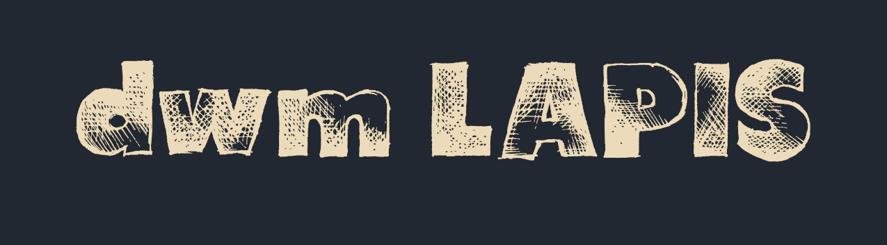
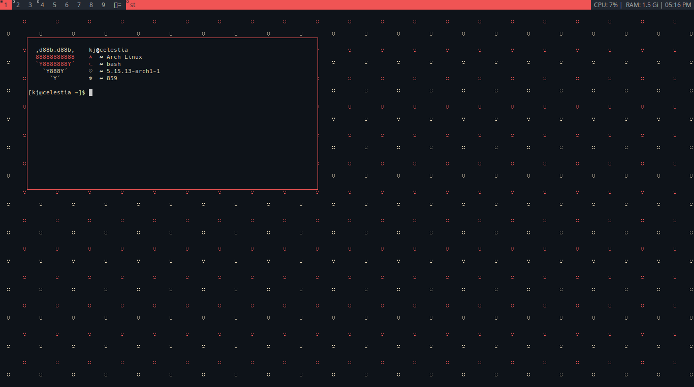
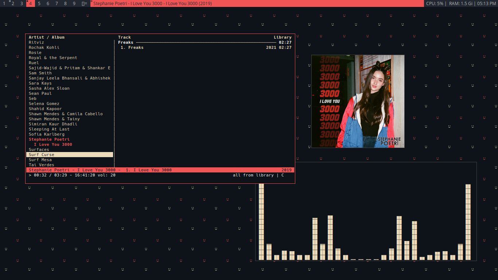

I recently switched to dwm from i3wm, it took me a while to get used to the dwm stuff and also the *suckless way* but now that i am aquiainted, I am really enjoying.
From installing the above builds, you may get something like this,

