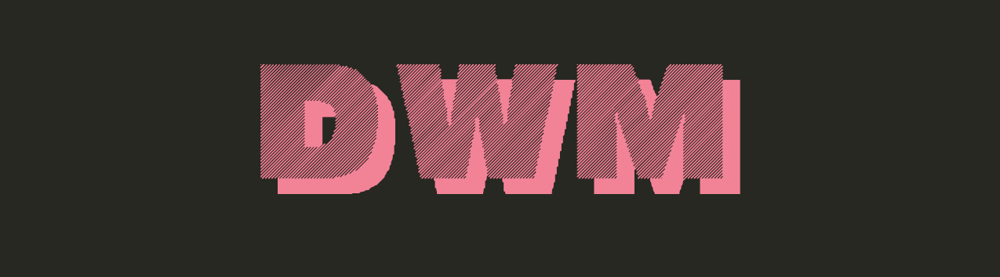
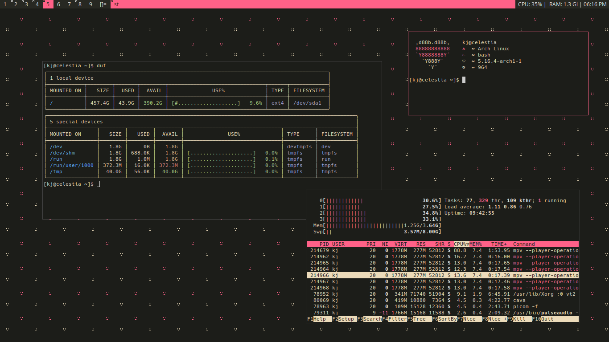
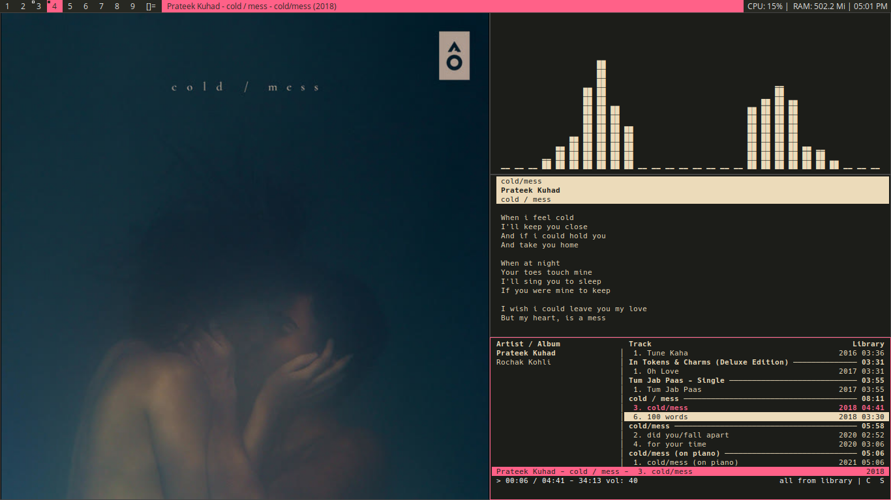
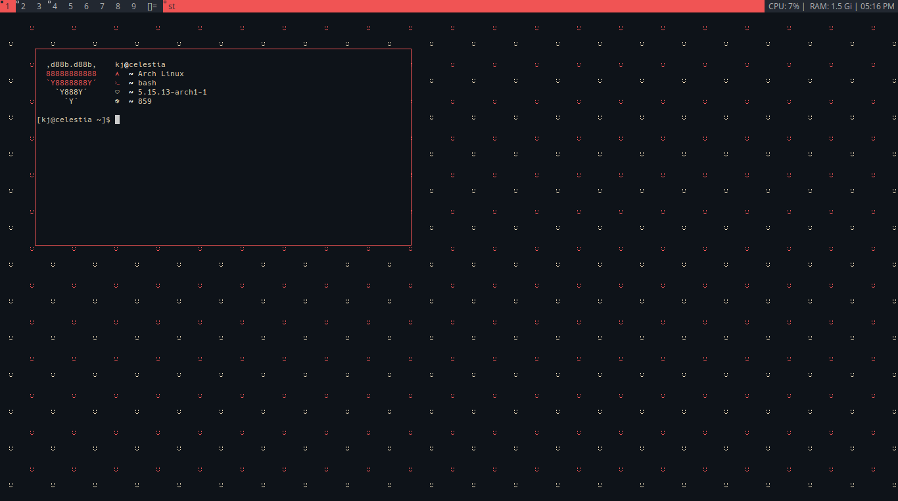
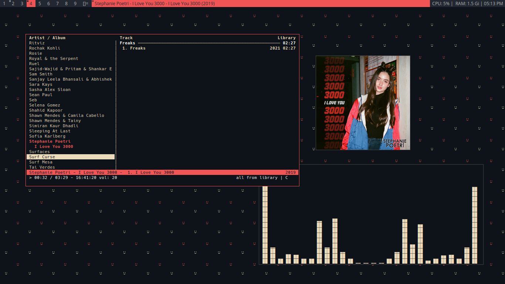

# Intro

I recently switched to dwm from i3wm, it took me a while to get used to the dwm stuff and also the *suckless way* but now that i am aquiainted, I am really addicted.
You can try my builds, and join the league.


# Installation

- Get into the `dmenu`, `dwm`, `slstatus` and `st` directories one using cd.
```bash
cd dmenu
cd dwm
cd st
cd slstatus
```

- Compile and install using:
```bash
sudo make clean install
```
Do this in each directory.

# Keybinds

|    Keybind           |          Action                     |
|:---                  |:---				     |
| mod4 + shift + enter | Terminal                            |
| mod4 + shift + d     | Dmenu                               |
| mod4 + q             | Kill client                         |
| mod4 + j,k           | Change focus                        |
| mod4 + h,l           | Increase/decrease window size       |
| mod4 + space         | Change layout                       |
                                                             
check the source code for more!

# Themes

Currently my setups only support 2 themes, will add more soon.

## CHERRYOC (DEFAULT)



## LAPIS
 <br>


# How to use themes?

There is a `#include "themes/theme.h>` line 
in config of each build at the top. To use Lapis, use:

`#include "themes/lapis.h"`
