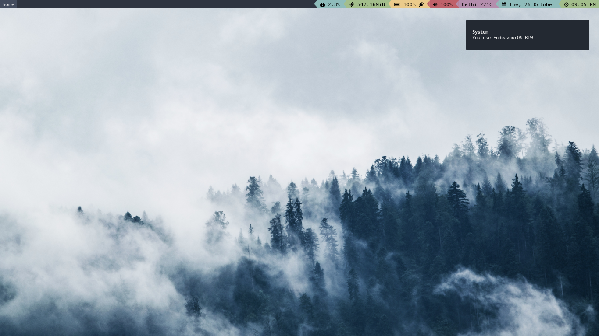
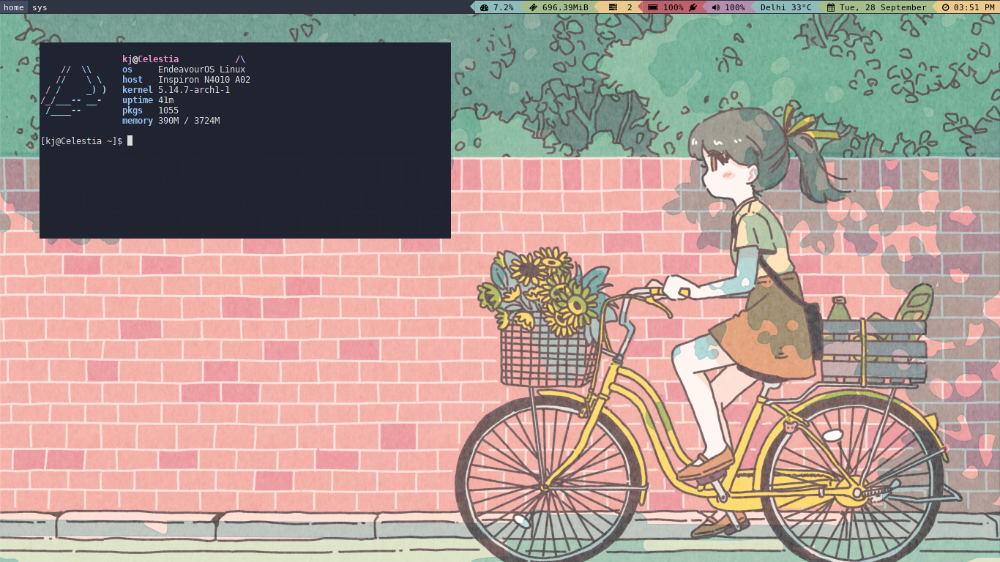

## INTRO

This is my i3-gaps rice, I made a few months ago as my daily driver. Although I have shifted to DWM, I use i3wm sometimes.
I have not added anything fancy, like some rofi menu scripts or something, this is a good base and you can add stuff if you like.

## SCREENSHOTS

   

## SOFTWARE

- WM: [i3-gaps](https://github.com/Airblader/i3)
- Statusbar: [bumblebee-status](https://github.com/tobi-wan-kenobi/bumblebee-status) 
- Terminal: [xfce4-terminal](https://github.com/xfce-mirror/xfce4-terminal)
- Notification Manager: [dunst](https://github.com/dunst-project/dunst)
- Lock: [i3lock-fancy-rapid](https://github.com/yvbbrjdr/i3lock-fancy-rapid)
- Wallpaper Manager: [nitrogen](https://github.com/l3ib/nitrogen)

## OUTRO

Thanks for visiting, any suggestions are welcome!
